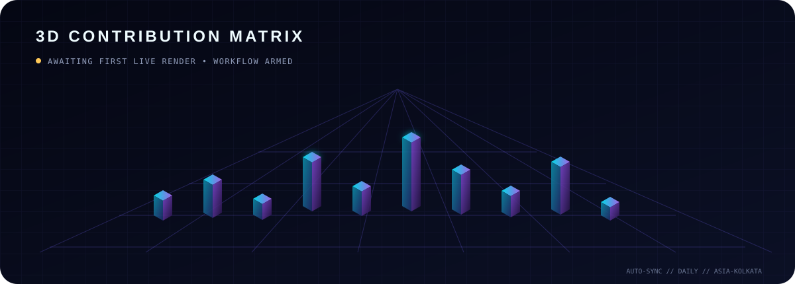

<div align="center">



<br />

<a href="https://www.linkedin.com/in/srujanmirji"></a>
<a href="https://x.com/srujanmirji10"></a>
<a href="https://instagram.com/srujan_mirji"></a>
<a href="https://github.com/Srujanmirji?tab=repositories"></a>

<br /><br />


</div>

<br />

## `01 // SYSTEM PROFILE`

```ts
const srujan = {
  role: "Full-Stack Developer",
  degree: "B.Tech CSE",
  coordinates: "India 🇮🇳",
  currentQuest: ["Java", "Spring Boot", "DSA", "Docker", "PostgreSQL"],
  buildZones: ["AI systems", "product engineering", "3D web", "native apps"],
  operatingPrinciple: "Make it useful. Make it fast. Make it unforgettable.",
};
```

I build across the stack, from APIs and data models to cinematic product interfaces. My recent work moves between **multi-agent AI**, **native macOS and Android apps**, **computer vision**, and **full-stack marketplaces**—always with a product-first mindset.

> **Current signal:** sharpening Java + Spring Boot, solving DSA, and exploring how AI, FinTech, and startup engineering collide.

<br />

## `02 // SELECTED BUILDS`

<table>
  <tr>
    <td width="50%" valign="top">
      <h3>🌀 <a href="https://github.com/Srujanmirji/aegisAI">AegisAI</a></h3>
      <p>Enterprise multi-agent AI copilot wrapped around a real-time WebGL Schwarzschild core.</p>
      <p><code>Three.js</code> <code>GLSL</code> <code>FastAPI</code> <code>LangGraph</code></p>
    </td>
    <td width="50%" valign="top">
      <h3>🪐 <a href="https://github.com/Srujanmirji/LiveWall">LiveWall</a></h3>
      <p>Native, performance-focused live wallpaper engine for macOS with multi-monitor control.</p>
      <p><code>Swift 6</code> <code>SwiftUI</code> <code>AppKit</code> <code>AVFoundation</code></p>
    </td>
  </tr>
  <tr>
    <td width="50%" valign="top">
      <h3>👁️ <a href="https://github.com/Srujanmirji/SmartVisionAssist">SmartVisionAssist</a></h3>
      <p>Offline accessibility assistant with real-time object detection, distance estimation, speech, and haptics.</p>
      <p><code>Kotlin</code> <code>CameraX</code> <code>TensorFlow Lite</code> <code>YOLOv8</code></p>
    </td>
    <td width="50%" valign="top">
      <h3>⚡ <a href="https://github.com/Srujanmirji/Codewick">SkillSwap</a></h3>
      <p>Time-credit skill marketplace with trust bootstrapping, messaging, wallets, and AI-assisted disputes.</p>
      <p><code>Next.js 15</code> <code>MongoDB</code> <code>NextAuth</code> <code>Framer Motion</code></p>
    </td>
  </tr>
</table>

<div align="center">
  <a href="https://github.com/Srujanmirji?tab=repositories"></a>
</div>

<br />

## `03 // TECH CONSTELLATION`

<div align="center">


<br /><br />


<br /><br />

`FRONTEND` **React · Next.js · Three.js** &nbsp;·&nbsp; `BACKEND` **Spring Boot · Node.js · FastAPI** &nbsp;·&nbsp; `DATA` **PostgreSQL · MongoDB · Supabase**

</div>

<br />

## `04 // 3D BUILD DIMENSION`

<div align="center">



<sub>A custom isometric skyline for the code × product × motion mindset. Live telemetry continues below.</sub>

</div>

<br />

## `05 // DEVELOPER TELEMETRY`

<div align="center">


<br />


</div>

<br />

## `06 // OPEN CHANNEL`

<div align="center">

I’m interested in **bold software ideas, startup-grade products, AI systems, and beautifully engineered interfaces**.

If that sounds like your frequency, connect with me.

<br />

<a href="https://www.linkedin.com/in/srujanmirji"></a>

<br /><br />


<sub><code>CODE × PRODUCT × MOTION × INTELLIGENCE</code></sub>

</div>
